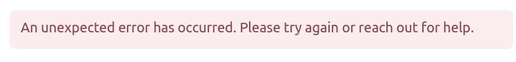
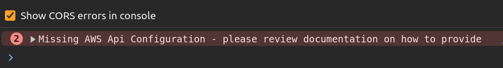
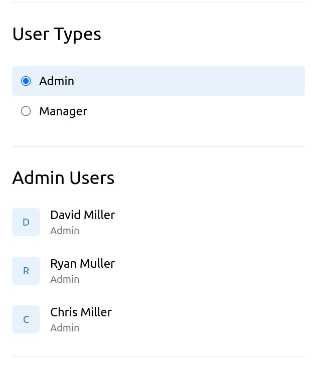

# Local Development Instructions

The recommended node version for development is `v18.18.2`+. 

If you have [Node Version Manager](https://github.com/nvm-sh/nvm) installed execute `nvm use` within the root directory to automatically switch to the target version via the provided `.nvmrc` file.

To setup the application correctly for outbound requests some minor env configuration is required. 

- Option 1
Create a `.env` file for the target environment e.g. `env.development.local` for local development and add the following variables:

```
REACT_APP_AWS_API_KEY=<YOUR_KEY_HERE>
REACT_APP_AWS_QUERY_ENDPOINT=<YOUR_TARGET_ENV_ENDPOINT_HERE>
```

- Option 2
Pass values to `npm start` directly as per below:

```
REACT_APP_AWS_API_KEY=<YOUR_KEY_HERE> REACT_APP_AWS_QUERY_ENDPOINT=<YOUR_TARGET_ENV_ENDPOINT_HERE> npm start
```

If your request configuration is not correctly setup you will see this message:



With a console error confirming the issue.



Once running the application can be viewed at [http://localhost:3000](http://localhost:3000). 

You should see a screen similar to below:



Customers are background loaded from the provided API endpoint.

To toggle between the customer lists click the respective radio buttons.

# Running the Test Suite

To launch the test runner in watch mode execute `npm test` in your terminal. 

By default Jest will only run tests relayed to file changes since the last commit. Every time you save a file, the test suite will be re-run.

To run the entire test suite press `a` once within watch mode.

# Building for Production

To create a minified production ready build run `npm build`.

The app will be built to the `build` folder.